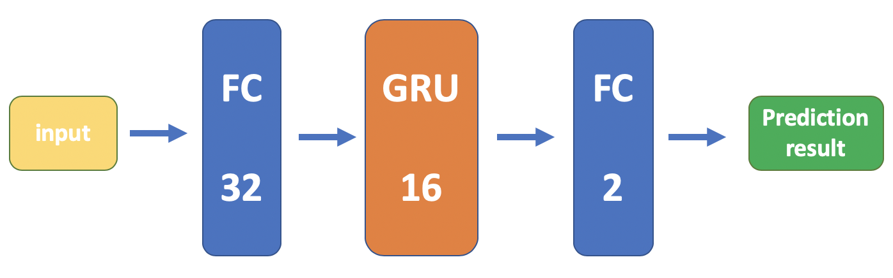

## ADS Project 5: Mortality Prediction Based on RNN with GRU

Term: Fall 2019

+ Kaiyan Zheng (kz2324)
+ Project summary: Mortality Prediction is always the topic worth exploration. Based on the dataset in MIMIC-III, this project uses RNN with GRU in Pytorch to predict mortality. 
  + Firstly, data preprocessing consists of building code dict for ICD-9 code, grouping date and splitting into lists.   
  + Secondly, to build custome Pytorch dataset and dataloader, each patient is represented by a matrix whose rows represents visits and column represents feature ID (unique code for ICD-9 code), each batch consist of 32 patients (matrixes) and is represented by a 3-dimensional tensor. 
  + Thirdly, the RNN model is built (the architecture is shown below). The input will be projected by the fully-connected layer with 32 hidden units and be passed through a Gate Recurrent Unit layer with 16 units, then the binary output is generated by another fully-connected layer. 
  + The model gets reasonable results: precision is 0.64, recall is 0.78. test accuracy is 0.75. All the process and results are shown in the `model_RNN.ipynb` and the [pdf file](https://github.com/TZstatsADS/fall2019-proj5-sec1-group1/blob/master/model_RNN%20-%20Jupyter%20Notebook.pdf) generated by this jupyter notebook.


	
Following [suggestions](http://nicercode.github.io/blog/2013-04-05-projects/) by [RICH FITZJOHN](http://nicercode.github.io/about/#Team) (@richfitz). This folder is orgarnized as follows.

```
proj/
├── model_RNN.ipynb
├── model_RNN - Jupyter Notebook.pdf
├── lib/
├── data/
│     └── mortality/
│             ├── data/
│     	      │     ├── ADMISSIONS.csv
│             │     ├── DIAGNOSES_ICD.csv
│     	      │     └── MORTALITY.csv
│     	      └── validation/
│     	            ├── ADMISSIONS.csv
│     	      	    ├── DIAGNOSES_ICD.csv
│     	            └── MORTALITY.csv
├── doc/
│    └── RNN.png
├── figs/
│    ├── MyNet_cm.png
│    ├── MyNet_loss_curve.png   
│    └── MyNet_acc_curve.png
└── output/
     ├── MyNet.pth
     └── my_predictions.csv
```
